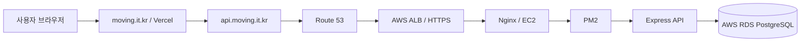

# 🚚 무빙(Moving) - Backend

> 일반 사용자와 이사 기사님을 연결하는 이사 견적 매칭 서비스 Backend API

## 🔗 바로가기

- 서비스: [https://moving.it.kr](https://moving.it.kr)
- API Server: [https://api.moving.it.kr](https://api.moving.it.kr)
- Swagger UI: [https://api.moving.it.kr/api-docs](https://api.moving.it.kr/api-docs)
- Health Check: [https://api.moving.it.kr/health](https://api.moving.it.kr/health)
- 팀 Notion: 추후 추가
- 프로젝트 회고록: 추후 추가
- Frontend Repository: [Moving-FE-Team1](https://github.com/kimchanhee0309/Moving-FE-Team1)

> Swagger UI는 서버의 `SWAGGER_ENABLED` 환경변수가 활성화된 환경에서 제공됩니다.

---

## 📌 프로젝트 소개

무빙은 이사를 준비하는 일반 사용자와 이사 서비스를 제공하는 기사님을 연결하는 이사 견적 매칭 플랫폼입니다.

Backend API는 다음 기능을 담당합니다.

- 사용자 인증·인가
- 일반 사용자와 기사님 프로필 관리
- 이사 견적 요청 관리
- 지정 견적 요청 관리
- 기사님의 견적 전송 및 요청 반려
- 일반 사용자의 견적 조회 및 확정
- 기사님 검색·필터·정렬
- 찜 및 리뷰
- 실시간 알림
- 프로필 이미지 업로드
- 비밀번호 찾기 및 재설정

- 프로젝트 기간: `2026.08 ~ 2026.10`
- 팀 구성: `6명`
- API 방식: `REST API`
- Database: `PostgreSQL`
- API Base Path: `/`

---

## ✨ 주요 기능

### 인증·인가

- 이메일 회원가입 및 로그인
- Google, Kakao, Naver OAuth
- Access Token·Refresh Token JWT 발급
- HttpOnly Cookie 기반 인증
- Access Token 갱신
- 로그아웃
- 현재 사용자 조회
- CUSTOMER·MOVER 역할 검사
- 역할별 프로필 등록 여부 검사
- 비밀번호 찾기 및 재설정
- 회원 탈퇴

### 프로필

- 일반 사용자 프로필 등록·조회·수정
- 기사님 프로필 등록·조회·수정
- 기사님 제공 서비스 및 활동 지역 관리
- 기사님 마이페이지 및 활동 현황
- 프로필 이미지 업로드

### 이사 요청 및 견적

- 일반 사용자의 이사 견적 요청 등록·조회·수정·삭제
- 특정 기사님에게 지정 견적 요청
- 기사님의 받은 요청 목록 조회
- 서비스 유형과 활동 지역 검증
- 일반·지정 견적 개수 제한
- 기사님의 견적 전송
- 요청 반려 및 반려 사유 저장
- 일반 사용자의 받은 견적 조회
- 견적 상세 조회
- 견적 확정
- 과거 확정 견적 조회
- 기사님의 보낸 견적 및 확정 견적 조회
- 기사님의 반려 요청 목록 조회

### 기사님 찾기

- 기사님 목록 조회
- 기사님 상세 조회
- 검색·정렬·서비스·지역 필터
- 추천 기사님 조회
- 기사님 리뷰 및 평점 조회

### 찜·리뷰

- 기사님 찜 등록·해제
- 찜한 기사님 목록 조회
- 작성 가능한 리뷰 조회
- 리뷰 등록
- 작성한 리뷰 조회
- 기사님이 받은 리뷰 조회

### 알림

- 사용자별 알림 목록 조회
- 알림 읽음 처리
- SSE 기반 실시간 알림
- 새 견적 알림
- 견적 확정 알림
- 새 요청 알림
- 이사 당일 알림
- 견적 요청 취소 알림

---

## 🛠 기술 스택

### Runtime & Framework

- Node.js
- Express 5
- TypeScript
- REST API

### Database

- PostgreSQL
- Prisma ORM 7
- `@prisma/adapter-pg`

### Authentication & Security

- JSON Web Token
- bcrypt
- HttpOnly Cookie
- CORS
- CSRF Origin Guard
- express-rate-limit

### Validation & Documentation

- Zod
- Swagger JSDoc
- Swagger UI
- OpenAPI 3.0.3

### File & Image

- Multer
- Sharp
- AWS SDK for JavaScript

### Test

- Jest
- ts-jest

### Deployment

- AWS EC2
- AWS RDS
- AWS ALB
- Nginx
- PM2
- Route 53
- GitHub Actions

### Collaboration

- GitHub
- Notion
- Discord
- Figma
- GitHub Pull Request Review

---

## 👥 팀원 구성 및 담당 기능

| 이름 | 역할 | 담당 기능 |
| --- | --- | --- |
| **김찬희** | 팀장 / FE·BE / 배포 | Backend 초기 설정, Prisma·Swagger 공통 구성, 기사님 받은 요청, 견적 전송·반려, 기사님 견적 관리, AWS 배포 |
| **김지훈** | FE·BE | 인증·인가, OAuth, 일반 사용자·기사님 프로필, 기사님 마이페이지 |
| **노진우** | FE·BE | 이사 견적 요청, 지정 견적 요청, 알림 |
| **이영주** | FE·BE | 기사님 목록·검색·정렬·필터, 기사님 상세 |
| **조민성** | FE·BE | 찜한 기사님, 리뷰 등록 및 조회 |
| **권태현** | FE·BE | 일반 사용자 받은 견적, 견적 상세·확정, 과거 견적 |

---

## 🏗 Backend Architecture

```text
HTTP Request
    ↓
Router
    ↓
Authentication / Authorization Middleware
    ↓
Controller
    ↓
Validator / DTO
    ↓
Service
    ↓
Repository
    ↓
Prisma
    ↓
PostgreSQL
```

### 계층별 책임

| 계층 | 책임 |
| --- | --- |
| Router | HTTP Method와 URI 선언, Middleware와 Controller 연결 |
| Controller | HTTP 입력 추출, Service 호출, 공통 응답 반환 |
| Validator·DTO | Params, Query, Body 검증 및 타입 변환 |
| Service | 권한, 비즈니스 규칙, 상태 전이, Transaction |
| Repository | Prisma Query와 데이터베이스 접근 |
| Middleware | 인증, 인가, 보안, 오류 처리 |
| Common | 공통 오류, 응답, Cookie, 상수, 유틸리티 |

---

## 🗂 폴더 구조

```text
moving-be-team1/
├─ prisma/
│  ├─ migrations/                  # Prisma Migration
│  ├─ schema.prisma                # Database Schema
│  └─ seed.ts                      # 개발용 Seed
│
├─ src/
│  ├─ common/
│  │  ├─ constants/                # HTTP 상태 및 공통 상수
│  │  ├─ cookies/                  # 인증 Cookie 처리
│  │  ├─ errors/                   # 공통 오류 Class
│  │  ├─ middleware/
│  │  │  ├─ auth/                  # 인증 및 역할별 Guard
│  │  │  ├─ http/                  # Error·Not Found Handler
│  │  │  └─ security/              # HTTPS·CSRF 보안 처리
│  │  ├─ response/                 # 공통 성공 응답
│  │  ├─ types/                    # 공통 Type
│  │  ├─ uploads/                  # 이미지 업로드 공통 처리
│  │  ├─ utils/                    # 공통 Utility
│  │  └─ validation/               # 공통 검증
│  │
│  ├─ config/
│  │  ├─ cors.ts
│  │  ├─ env.ts
│  │  └─ swagger.ts
│  │
│  ├─ generated/                   # Prisma 자동 생성 파일
│  ├─ lib/                         # Prisma Client 등 Infrastructure
│  │
│  ├─ modules/
│  │  ├─ auth/
│  │  ├─ customer-profile/
│  │  ├─ customer-quote/
│  │  ├─ favorite/
│  │  ├─ move-request/
│  │  ├─ mover-mypage/
│  │  ├─ mover-profile/
│  │  ├─ mover-quote/
│  │  ├─ mover-request/
│  │  ├─ mover-search/
│  │  ├─ notification/
│  │  └─ review/
│  │
│  ├─ routes/
│  │  └─ index.ts                  # 최상위 Router
│  │
│  ├─ app.ts                       # Express Middleware와 Router 조립
│  └─ server.ts                    # DB 연결 및 Server Lifecycle
│
├─ tests/                           # Jest 단위 테스트
├─ docs/                            # 프로젝트 문서
├─ prisma.config.ts
├─ tsconfig.json
├─ eslint.config.mjs
├─ package.json
└─ README.md
```

---

## 🗄 주요 데이터 모델

```text
User
├─ Customer
├─ Mover
├─ Notification
└─ Favorite

Customer
├─ MoveRequest
├─ Review
└─ Favorite

Mover
├─ Quote
├─ RequestRejection
├─ Review
├─ ServiceType
└─ Region

MoveRequest
├─ DesignatedRequest
├─ Quote
├─ RequestRejection
└─ Review
```

### 주요 상태값

#### MoveRequestStatus

| 상태 | 의미 |
| --- | --- |
| `WAITING` | 견적을 기다리는 요청 |
| `CONFIRMED` | 견적이 확정된 요청 |
| `COMPLETED` | 이사가 완료된 요청 |

#### QuoteStatus

| 상태 | 의미 |
| --- | --- |
| `PROPOSED` | 기사님이 견적을 제안한 상태 |
| `CONFIRMED` | 일반 사용자가 견적을 확정한 상태 |
| `REJECTED` | 거절되거나 선택되지 않은 견적 |

---

## 🌐 주요 API

API 경로는 별도의 `/api` Prefix 없이 `/`부터 시작합니다.

### 인증

| Method | Endpoint | 설명 |
| --- | --- | --- |
| `POST` | `/auth/signup` | 회원가입 |
| `POST` | `/auth/login` | 로그인 |
| `GET` | `/auth/me` | 현재 사용자 조회 |
| `POST` | `/auth/refresh` | Access·Refresh Token 재발급 |
| `POST` | `/auth/logout` | 로그아웃 |
| `DELETE` | `/auth/me` | 회원 탈퇴 |
| `GET` | `/auth/oauth/:provider` | OAuth 로그인 시작 |
| `GET` | `/auth/oauth/:provider/callback` | OAuth Callback |

### 이사 요청

| Method | Endpoint | 설명 |
| --- | --- | --- |
| `POST` | `/customers/me/move-requests` | 이사 견적 요청 등록 |
| `GET` | `/customers/me/move-requests/active` | 활성 요청 조회 |
| `PATCH` | `/customers/me/move-requests/:moveRequestId` | 이사 요청 수정 |
| `DELETE` | `/customers/me/move-requests/:moveRequestId` | 이사 요청 삭제 |
| `POST` | `/customers/me/move-requests/:moveRequestId/designated-requests` | 지정 견적 요청 |

### 기사님 받은 요청·견적

| Method | Endpoint | 설명 |
| --- | --- | --- |
| `GET` | `/movers/me/received-requests` | 기사님 받은 요청 조회 |
| `POST` | `/movers/me/received-requests/:requestId/quotes` | 견적 보내기 |
| `POST` | `/movers/me/received-requests/:requestId/rejections` | 요청 반려하기 |
| `GET` | `/movers/me/quotes` | 기사님이 보낸 견적 조회 |
| `GET` | `/movers/me/quotes/:quoteId` | 기사님 견적 상세 조회 |
| `GET` | `/movers/me/rejected-requests` | 반려한 요청 조회 |

### 일반 사용자 견적

| Method | Endpoint | 설명 |
| --- | --- | --- |
| `GET` | `/customers/me/quotes` | 받은 대기 견적 조회 |
| `GET` | `/customers/me/quotes/:quoteId` | 받은 견적 상세 조회 |
| `POST` | `/customers/me/quotes/:quoteId/confirm` | 견적 확정 |
| `GET` | `/customers/me/quotes/history` | 과거 확정 견적 조회 |
| `GET` | `/customers/me/quotes/history/:quoteId` | 과거 견적 상세 조회 |

### 기사님 찾기

| Method | Endpoint | 설명 |
| --- | --- | --- |
| `GET` | `/movers` | 기사님 목록 조회 |
| `GET` | `/movers/recommended` | 추천 기사님 조회 |
| `GET` | `/movers/:id` | 기사님 상세 조회 |
| `GET` | `/movers/:moverId/reviews` | 기사님 리뷰 조회 |

### 찜·리뷰·알림

| Method | Endpoint | 설명 |
| --- | --- | --- |
| `GET` | `/favorites` | 찜한 기사님 조회 |
| `POST` | `/favorites/:moverId` | 기사님 찜 |
| `DELETE` | `/favorites/:moverId` | 기사님 찜 해제 |
| `POST` | `/reviews` | 리뷰 등록 |
| `GET` | `/notifications` | 알림 목록 조회 |
| `PATCH` | `/notifications/:notificationId/read` | 알림 읽음 처리 |
| `GET` | `/notifications/stream` | SSE 실시간 알림 연결 |

전체 요청·응답 명세는 Swagger UI에서 확인할 수 있습니다.

---

## 📦 공통 응답 형식

### 성공 응답

```json
{
  "success": true,
  "data": {
    "items": []
  }
}
```

### 오류 응답

```json
{
  "success": false,
  "error": {
    "code": "ERROR_CODE",
    "message": "오류 메시지",
    "details": [
      {
        "field": "email",
        "reason": "이메일 형식이 올바르지 않습니다."
      }
    ]
  }
}
```

---

## 🔐 인증 방식

Access Token과 Refresh Token을 JWT로 발급하고 HttpOnly Cookie로 전달합니다.

| 항목 | 정책 |
| --- | --- |
| Access Token | JWT, 기본 30분 |
| Refresh Token | JWT, 기본 7일 |
| 저장 위치 | HttpOnly Cookie |
| 서명 알고리즘 | HS256 |
| Cookie Secure | 운영 환경에서 `true` |
| Cookie SameSite | 환경변수로 관리 |
| Refresh 정책 | Access·Refresh Token 모두 재발급 |

```text
로그인
→ Access/Refresh Token 발급
→ HttpOnly Cookie 저장
→ 인증 Middleware
→ 역할 및 프로필 검사
→ Service에서 Resource 소유권 확인
```

Refresh Token은 현재 서버 DB에 저장하지 않는 Stateless 방식입니다. 따라서 로그아웃 시 브라우저 Cookie는 삭제하지만, 외부로 복사된 기존 Refresh Token을 서버에서 즉시 폐기하거나 재사용 탐지하는 기능은 MVP 범위에 포함되지 않습니다.

---

## ⚙️ 환경변수

`.env.example`을 복사해 `.env`를 생성합니다.

```bash
cp .env.example .env
```

주요 환경변수는 다음과 같습니다.

```env
NODE_ENV=
PORT=
DATABASE_URL=

CORS_ORIGINS=
FRONTEND_URL=
OAUTH_CALLBACK_BASE_URL=

GOOGLE_CLIENT_ID=
GOOGLE_CLIENT_SECRET=
KAKAO_CLIENT_ID=
KAKAO_CLIENT_SECRET=
NAVER_CLIENT_ID=
NAVER_CLIENT_SECRET=

ACCESS_TOKEN_SECRET=
REFRESH_TOKEN_SECRET=
PASSWORD_RESET_TOKEN_SECRET=
PASSWORD_RESET_CODE_SECRET=
JWT_ISSUER=

PASSWORD_RESET_DELIVERY=
SMTP_HOST=
SMTP_PORT=
SMTP_SECURE=
SMTP_USER=
SMTP_PASS=
SMTP_FROM=

COOKIE_DOMAIN=
COOKIE_SECURE=
COOKIE_SAME_SITE=
ACCESS_TOKEN_MAX_AGE_MS=
REFRESH_TOKEN_MAX_AGE_MS=

TRUST_PROXY=
SWAGGER_ENABLED=
```

> 실제 Database URL, JWT Secret, OAuth Secret과 SMTP 비밀번호를 Git에 커밋하지 않습니다.

---

## 🚀 로컬 실행 방법

### 1. 저장소 Clone

```bash
git clone https://github.com/kimchanhee0309/Moving-BE-Team1.git
cd Moving-BE-Team1
```

### 2. 의존성 설치

```bash
npm ci
```

### 3. 환경변수 생성

```bash
cp .env.example .env
```

`.env`에 로컬 Database와 인증 관련 값을 설정합니다.

### 4. Prisma Client 생성

```bash
npm run prisma:generate
```

### 5. Migration 적용

개발 환경에서 새 Migration을 생성하고 적용할 경우:

```bash
npm run prisma:migrate
```

이미 생성된 Migration을 운영 환경에 적용할 경우:

```bash
npx prisma migrate deploy
```

### 6. Seed 데이터 생성

```bash
npx prisma db seed
```

> Seed는 기존 개발용 데이터를 삭제하거나 변경할 수 있으므로 실행 전 연결된 Database를 반드시 확인합니다.

### 7. 개발 서버 실행

```bash
npm run dev
```

기본 주소:

```text
API: http://localhost:4000
Health Check: http://localhost:4000/health
Swagger UI: http://localhost:4000/api-docs
```

---

## 📜 실행 명령어

| 명령어 | 설명 |
| --- | --- |
| `npm run dev` | TypeScript 개발 서버 실행 |
| `npm run typecheck` | TypeScript 타입 검사 |
| `npm run build` | `dist` 운영 빌드 생성 |
| `npm start` | 빌드된 서버 실행 |
| `npm run lint` | ESLint 검사 |
| `npm test` | Jest 테스트 실행 |
| `npm run test:watch` | Jest Watch Mode |
| `npm run test:coverage` | 테스트 Coverage 측정 |
| `npm run test:ci` | CI용 테스트 및 Coverage 검사 |
| `npm run prisma:generate` | Prisma Client 생성 |
| `npm run prisma:migrate` | 개발 Migration 생성·적용 |
| `npm run prisma:studio` | Prisma Studio 실행 |

---

## ✅ 검증 방법

Pull Request 생성 전 다음 명령을 실행합니다.

```bash
npm run typecheck
npm run lint
npm test
npm run build
```

API를 변경한 경우 다음 항목도 함께 확인합니다.

- Swagger 요청·응답과 실제 API 일치 여부
- Zod Validator와 Swagger 제한 조건 일치 여부
- Prisma Schema와 응답 DTO 일치 여부
- 인증·역할·프로필 Middleware 적용 여부
- 정상·입력 오류·권한 오류·중복 처리 테스트
- Cursor Pagination 경계값

---

## 🌐 배포 구조



### 운영 구성

- Frontend: Vercel
- Backend: AWS EC2
- Database: AWS RDS PostgreSQL
- HTTPS 종료: AWS ALB
- Reverse Proxy: Nginx
- Process Manager: PM2
- DNS: Route 53
- API Domain: `api.moving.it.kr`
- CI/CD: GitHub Actions

운영 환경에서 PM2는 TypeScript 원본이 아닌 빌드 결과를 실행합니다.

```text
dist/server.js
```

---

## 🌿 Git 브랜치 전략

```text
main
└─ dev
   ├─ feat/*
   ├─ fix/*
   ├─ refactor/*
   ├─ docs/*
   └─ chore/*
```

- `main`: 배포 브랜치
- `dev`: 개발 통합 브랜치
- `feat/*`: 기능 개발 브랜치
- 기능 브랜치에서 `dev`로 Pull Request 생성
- 팀 리뷰와 Approve 후 Squash and Merge

### Commit Convention

```text
feat: 새로운 기능
fix: 버그 수정
refactor: 리팩터링
docs: 문서 수정
chore: 환경 설정 및 기타 작업
test: 테스트 추가 및 수정
```

---

## 📚 API 문서

Swagger UI:

```text
https://api.moving.it.kr/api-docs
```

OpenAPI JSON:

```text
https://api.moving.it.kr/api-docs.json
```

Local Swagger UI:

```text
http://localhost:4000/api-docs
```

---

## 📝 관련 문서

- 팀 Notion: 추후 추가
- 프로젝트 회고록: 추후 추가
- Frontend Repository: [Moving-FE-Team1](https://github.com/kimchanhee0309/Moving-FE-Team1)
- Swagger UI: [API 문서](https://api.moving.it.kr/api-docs)
